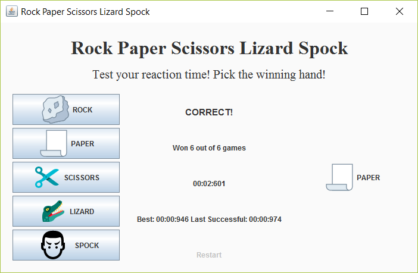

# Rock Paper Scissors Lizard Spock Reaction Tester
This is a little Java application to play [Rock Paper Scissors Lizard Spock](http://www.samkass.com/theories/RPSSL.html) with a slight variation - the computer's choice is displayed on screen first, and the player's goal is to pick the correct combination that beats the computer in the fastest time possible. The time taken for each successful recorded and the best time is tracked and displayed. 

The game is intended to train both one's understanding of the game, and also improve one's reaction time. 

## Motivation

I needed a quick and fun warmup project and so I built this silly little game in an afternoon for people like me who can never quite remember whether Spock kills Lizard or Lizard poisons Spock in RPSLS. I was inspired by brain training games and decided to use a similar format. I hope you enjoy playing it as much as I did!  

## Executing the Build
You can execute the build using one of the following commands from the root of the project:

- ./gradlew <task> (on Unix-like platforms such as Linux and Mac OS X)
- gradlew <task> (on Windows using the gradlew.bat batch file)

## Future Work
Some ideas that I will be working on
- A High Score Table
- A limit for game - either by time (e.g. 30s) or by number of Rounds

## Screenshot

